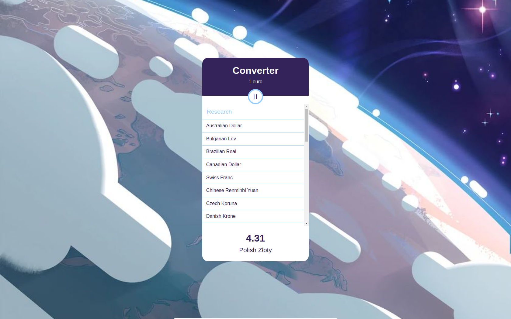
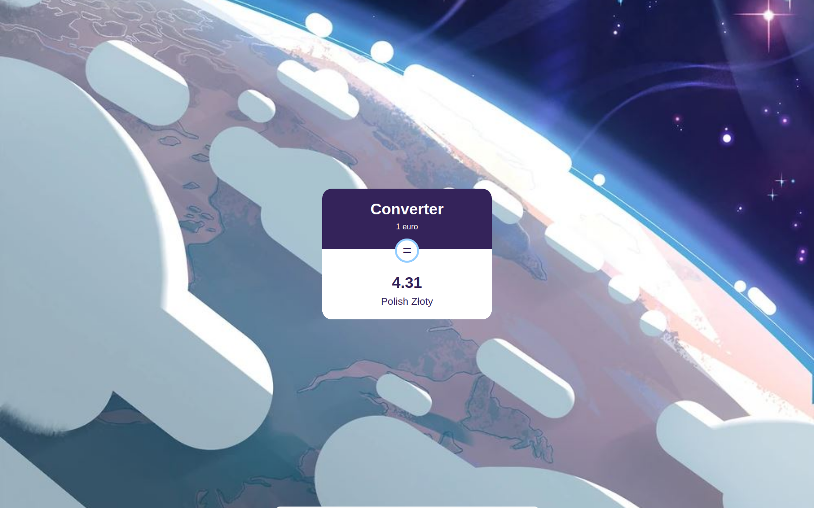

# Currency converter

Bienvenue dans le projet Currency converter !
L'objectif de ce projet est de créer un convertisseur de devises en utilisant React / JS et du SCSS.

## Description

Le Currency converter est une application de conversion de devises utilisant React. Cette application permet aux utilisateurs de convertir 1 euro dans différentes devises. Les utilisateurs peuvent sélectionner une devise dans la liste fournie*, et le montant converti sera affiché dans le pied de page. De plus, le convertisseur comporte un bouton de bascule pour afficher ou masquer la liste des devises et un champ de recherche pour trouver facilement des devises spécifiques.

**Les données utilisées pour les taux de conversion proviennent d'un tableau préexistant dans le dossier "data" du projet, plutôt que d'une API externe.*

## Fonctionnalités

- Conversion de devises : Convertir 1 euro dans différentes devises.
- Afficher/Masquer la liste des devises : Basculer la visibilité de la liste des devises avec le bouton "=".
- Filtre de recherche de devises : Rechercher des devises spécifiques à l'aide du champ de recherche des devises.

## Screenshots




## Instructions

### Installation

#### 1. Cloner le dépôt

```console
git clone git@github.com:Mounir-Bmz/Currency_converter.git
```

#### 2. Accéder au répertoire du projet 

```console
cd Currency_converter
```

#### 3. Installer les dépendances requises avec Yarn

```console
yarn
```

#### 4. Lancer le serveur de développement

```console
yarn dev
```

## Remarques

Ce projet a été réalisé dans le cadre d'un exercice pour pratiquer les concepts du développement React.
